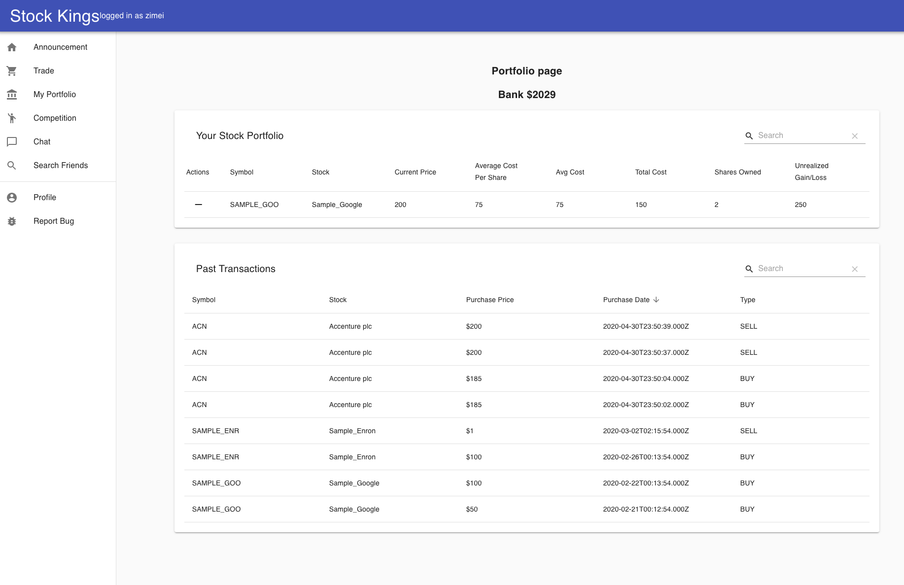

# Stock Kings

Final Report - Iteration 3  
Boston University Term Project - CS673
Team 5

## Executive Summary

The term project is considered successful as a minimum viable product. As a team we were able to build a product that demonstrates basic sets of capabilities to buy, sell and track the stock market changes with live market data using the Yahoo API. All transaction data is stored in a persistent database and is presented to the user in a clean and intuitive interface.

All “must have” requirements were completed and ⅓ of the “nice-to-have” requirements were partially completed. ⅔ of the “nice-to-have” requirements were not able to be completed. Although this falls short of our target due to extenuating circumstances, we were able to deliver a minimal product.

The team understands that if this were a real product impacting real users, there are other areas of improvement as discussed in class lectures such as testing, security, reliability, and other product attributes. Pros and cons of these areas are discussed specific to our application in this report.

For the team, this was a significant learning experience and we are better equipped for those team members looking to enter the professional environment.

Project source code is here:
Github: https://github.com/johnsliao/cs673-team-5

All meeting notes and documentation is here:
Google Drive: https://drive.google.com/open?id=1DY4QYDgbLuDMglUs6xQzo2oLUtgf4N1y

## Project Background

Today it is recommended that people should start investing their money as soon as they are able to. One form of investment that many people know of are stocks. Yet many people aren’t comfortable with stocks and which they should be investing in. To combat this, an environment will be created that will encourage users to be able to follow and try their hand at stocks in a no risk environment while being engaging and a good learning experience.
Our project will be a stock fantasy trading league where users will be able to follow and “buy” publicly-traded stocks. These stocks will be tracked and show users how the price changes over periods of time, ranging from daily to weekly performance. Other features include stock recommendation system, social media sharing/group chat, and performance comparison among users.

The application is planned to have a clean and intuitive front-end interface supported by persistent data storage. The number of web pages will be kept to a minimum. The application will be hosted in the cloud for public use. Functional requirements are enumerated below in terms of need-to-haves and nice-to-haves. It is planned for team members to work collaboratively using git for version control, Trello for issue tracking, transparency for stakeholders (Professor and TA), Slack for cross-team communication, and an open source CI/CD (CircleCI/Jenkins) pipeline for testing to reduce bugs. The team plans have taken a more aggressive approach in functional requirements and will scale back based on the semester timeline.

### Problem Space

- It’s recommend for people to invest as early as they can, but aren’t sure where to start
- Investing in the stock market can be risky
- Current stock simulator apps are not engaging

### Solution

- Risk-free stock simulator trading application
- Simple and intuitive
- Social and engaging

### How

- Agile methodology
- Modern version control (git)
- Continuous integration/Continuous development (CI/CD)
- Collaborative balanced-team approach

### Team Members

- John Liao
- Matthew Zimei
- Zihao Li
- Kevin Duran
- Junfeng Zhang
- Yijie Fang

## Areas of Improvement Discussion

### Reliability

The application was a minimal viable product, so there was not a significant level of complexity for the functions it could do. The application was never deployed to a production environment and only hosted in a developer localhost. Reliability could be further improved by comprehensive levels of testing, ranging from unit tests to end-to-end journey style tests.

### Availability

The application was only a single instance and not hosted in a production environment. If we were to have pursued this further, we could consider ideas for high availability, ranging from multi instance full copied instances to a distributed design. If the application was to consider scenarios such as high traffic, load balancing with failovers could be introduced.

### Resilience

Resilience falls in line with how well the application can handle stress. In addition to functional testing, other non-functional attributes could be tested as well. Questions such as, how well does the server perform under load (stress testing) or how quickly does the client application navigate through pages (performance testing) could be considered. There are other tools that could be employed like Google Lighthouse or Postman to automate these tools.

### Maintainability

Maintainability is a key concept in devops. The maintainability of the application is important for how developers can pay off tech debt and deliver code to production on a consistent basis. In terms of reducing technical debt, it would be important for us to prioritize architectural decisions quickly and decisively -- ideally without bureaucratic and unnecessary gates to achieve this. A formalized process would be important to do this on a regular basis. On a daily basis, if we had decided, we could employ Extreme Programming techniques such as Test Driven Development (TDD) or paired-programming.

In order to deliver code to production quickly, a flexible continuous integration and continuous development pipeline would need to be put in place. Tools like Jenkins or CircleCI are available for use. In order to have the application run on multiple environments, tools like Docker could be used. In the pipeline, all of our automated test suites (performance, stress, unit, integration, end to end, security) would be run on a regular basis and problems would be flagged to cause problems early.

### Responsiveness

The responsiveness of the application is important from a usability perspective for users. We were able to employ React and Node JS to build a strong foundation to build off of. In terms of performance within the application, we could optimize state handling by employing libraries such as MobX or Redux.

### Security

Our application did not perform well in terms of security. For example, usernames and passwords were stored unencrypted in plain text. If we were to move to a production environment, this would be a blocker. In order to mitigate this, we could employ a straight-forward hashing algorithm with salting. If we were to take it a step further, we could secure our application with certificates and trusted certificate authorities (CA). In the development pipeline, we could employ SonarQube and regular static code analysis (SCA) to review possible security vulnerabilities and prioritize as needed.

## Functional Requirements and Final Status

The following are functional requirements that are "must" haves.

Next to each item is who worked on it.

1. COMPLETE Consume the data from Yahoo Finance API (Matt, John, Zihao)
   The backend of the application is able to successfully ingest data from Yahoo API and store it in the database.
   Cron job pulls information from Yahoo API and stores in MySQL
2. PARTIAL User registration (user name, password, email) (Yijie, John)
   Users are not able to register username, password, and email. However, users are able to log in using existing seed data.
   User actions like resetting password, username, and email are working as expected. Any new data is used for authentication into the application.
3. COMPLETE User has the ability to buy stocks (John, Zihao, Matt)
   Stocks are able to be purchased from live market data using Yahoo API from the user. The new data can be ingested on a regular basis into the database using a simple script. User transactions have timestamps and their portfolio calculates how much they have made (e.g. capital gains/losses).
4. COMPLETE User has the ability to compare stocks to other users (John, Matt)
   Users are able to compare their portfolio to that of their friends. This view is very similar to the view to see their own portfolio.
5. COMPLETE User has the ability to report issues/bugs (John)
   Users are able to submit issues/bugs. Upon submission, a simple pop up will appear that shows their issue was submitted successfully.
6. COMPLETE Backend fully functional (Matt, John)
   Tables include:
   UserAccount: Stores necessary user info to create an account
   Stocks: The stocks a user has purchased
   Competitions: Groundwork table for competitions functionality
   Friendship: Table to link multiple users together as friends
   Portfolio: A user’s full suite of purchased stocks
   StockNamesLookup: Symbol/shortname pair that gets populated from the Yahoo API for easier lookups
   Transactions: Information about each transaction the user has completed
   ForumMessages: Chat table that each user can post to. Visible to all users.
   Stored Procedures for easier query access and to avoid inline SQL
7. COMPLETE Middleware fully functional (Matt)
   Node.js application built to serve as the middleware between the Stock Kings React.js web application and the MySQL database. POST/GET services used for accessing MySQL data.

The following are functional requirements that are "nice" to have..

1. INCOMPLETE Stock recommendation system (Yijie, Zihao)
   Due to complexity, this wasn’t a feasible option and was dropped.
2. PARTIAL Daily competitions (John, Kevin)
   Due to technical and personal issues, this wasn’t completed on time. However, users are properly associated with competitions from the seed data and properly displayed in the application.
3. PARTIAL Chat/message board/social media (Junfeng)
   Chat Demo complete, the only difficulty cannot connect to the database.

## Non-Functional Requirements and Final Status

1. COMPLETE Nice-looking and intuitive UI (Team)
   Our team used React, Node JS, and MySQL. This tech stack is ideal for this type of application and allowed for quick iterations and usability.
2. COMPLETE Fast response time with stock API (Matt, John, Junfeng)
   The backend is able to query Yahoo API and ingest the data nearly instantaneously. This NFR was achieved.
